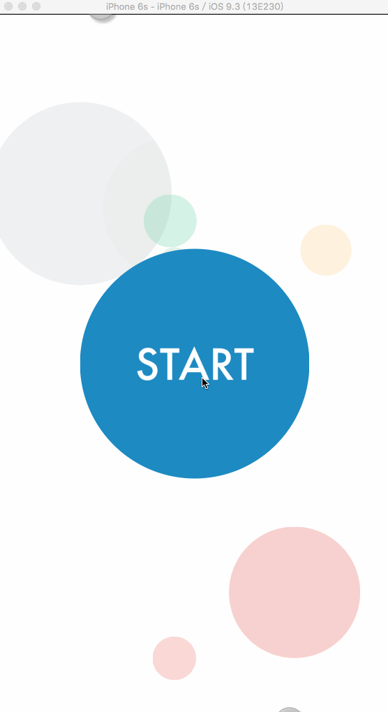

# LastCircle

A simple game developed by Swift([App Store](https://itunes.apple.com/us/app/last-circle/id1065436363?ls=1&mt=8)).

Last Circle is a game for testing and chanlleging your short-term memory.

To go to the next round, you must tap the latest circle on the screen(positionally, not the color and size). Every circle in every round appears in random different color and order, which makes the game very difficult to proceed. In fact, most people cannot score more than 500(mine is 1680).

This game is themed by selected flat colors and simple animations.

iCloud and common sharing are suppoted, but I removed the sharing SDK and code in this repository for private cause.

Hope you enjoy it and supporting me by purchasing on the [App Store](https://itunes.apple.com/us/app/last-circle/id1065436363?ls=1&mt=8).
